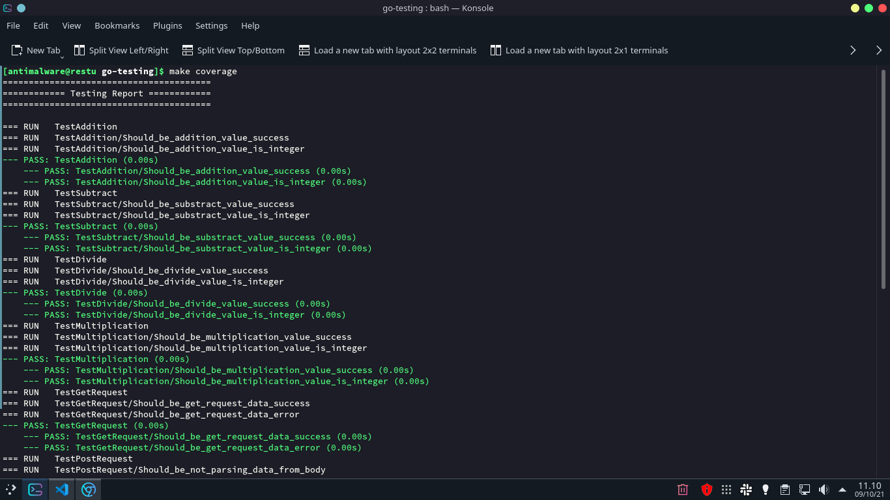
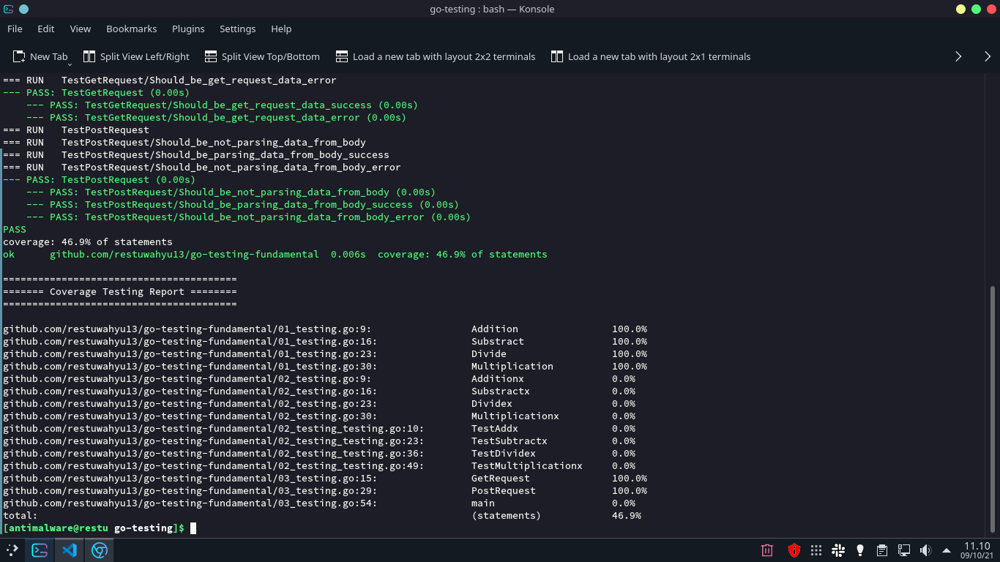

# Golang Fundamental Testing

`Example` write basic fundamental testing in Golang

## Implementation Case

- **01_testing** write testing
- **02_testing** write testing using testify
- **03_testing** write API testing using testify
- **04_testing** write API testing using gin framework, testify and go supertest

## Command

- ### Testing

```sh
$ make test || go test -v ./...
```

- ### Coverage Testing

```sh
$ make coverage || go test -cover -v ./... || go test -coverprofile=coverage.out ./... || go tool cover -func=coverage.out
```

## Testing And Coverage Testing Result



